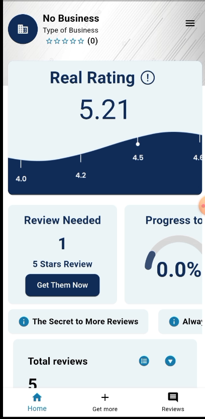
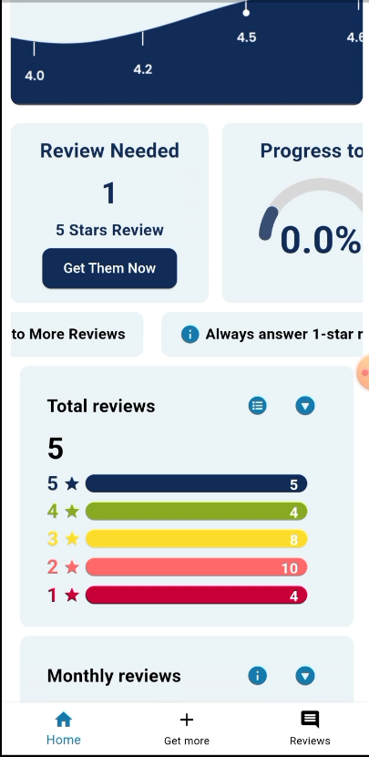
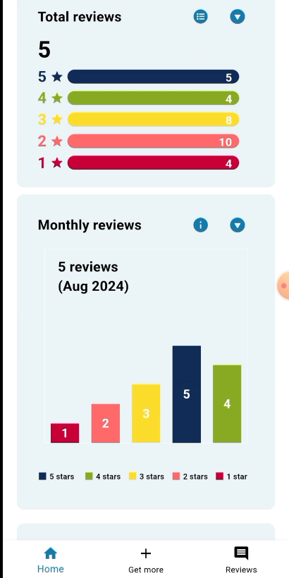
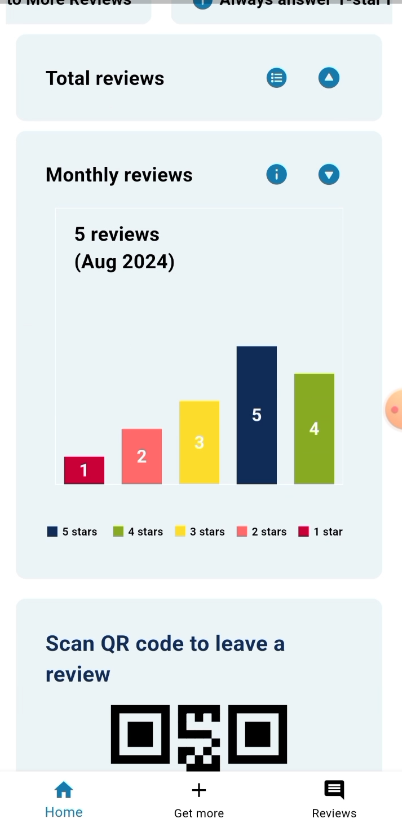
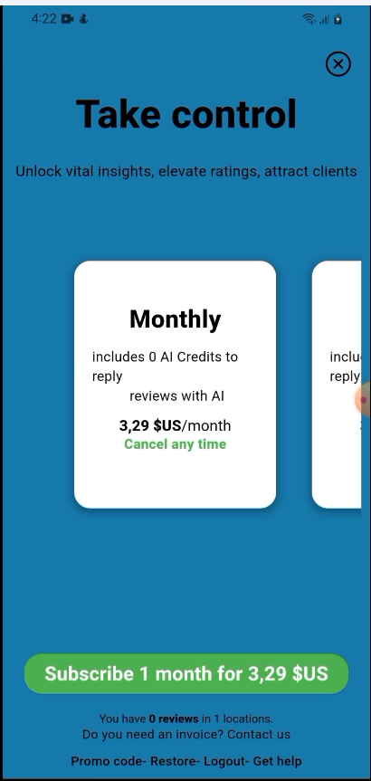
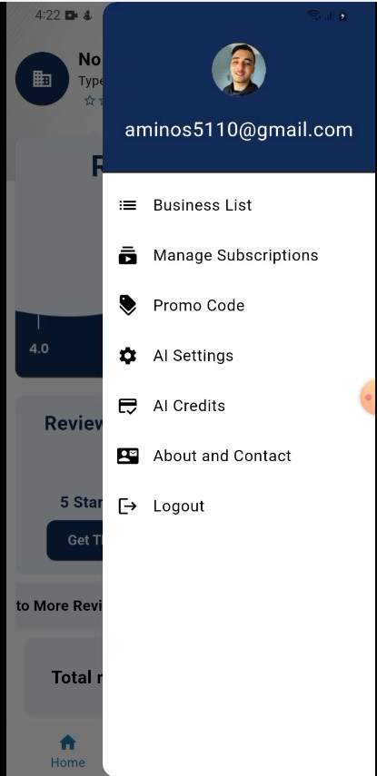
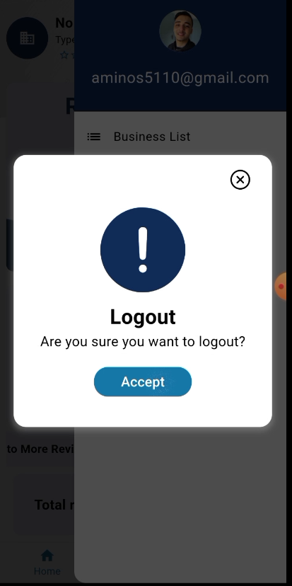
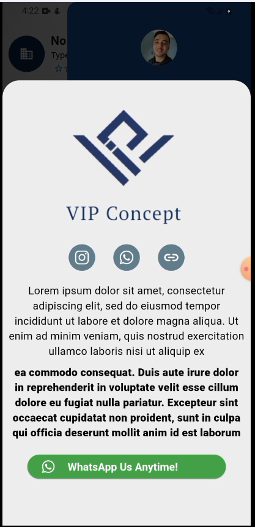

# 📱 VipConcept

**VipConcept** is a Flutter-based mobile app that helps business owners manage and make the most out of their **Google Maps reviews**. With powerful features like comment replies, performance tracking, and visual insights, it’s a must-have tool to enhance your online presence and reputation.

---

## ✨ Features

- 📊 **View and Analyze Ratings**
  - See your Google Maps ratings weekly, monthly, or overall
  - Visual graphs for better insight into customer feedback trends

- 💬 **Respond to Reviews**
  - Read and reply to customer reviews directly from the app

- 📈 **Performance Visualization**
  - Auto-generated graphs based on your rating history
  - Identify peaks and drops in customer satisfaction

---

## 🛠️ Built With

- **Frontend:** [Flutter](https://flutter.dev/)  
  - Cross-platform, fast, and beautiful UI
- **Backend:** [Node.js](https://nodejs.org/)  
  - API services, Google Maps review handling, and data management

---

## 📸 Screenshots

---

## 🎬 Demo Video

Watch the demo here:  
📽 [Download demo video](lib\core\assets\demo\VipConceptAppDemoVideo.mp4)
